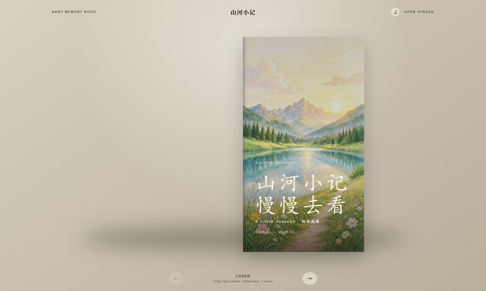

# 🎞️ img-memory-skill · 照片翻页记忆书 Skill

> **Create Photo Flipbook UI** — 把一叠普通照片，变成一本可以翻页的 3D 记忆书。

A style-neutral Codex skill that turns raw photo collections or finished pages
into curated, page-turning photo books using raw HTML, CSS, and vanilla
JavaScript — with story timeline, sound, motion, and PDF export.

用自然语言描述你的照片，Agent 会完成**选片 → 文案 → 艺术化 → 装帧 → 声音 → PDF** 的完整流程，产出一本精致、有故事感、可交互的 HTML 3D 翻页书（附 PDF 导出）。

---

## 🖼️ 效果预览

> 以下是一本**不含任何人物**的演示书《山河小记》（AI 生成的四季风景），
> 完整展示了混合视觉方向、时间线文案、氛围动效与声音体验。
> 点开即可体验翻页 —— **已通过 GitHub Pages 在线部署**，仓库内也附完整可运行源码（`docs/demo/`）。

**▶️ 在线体验**（无需克隆，点开即翻）：
- 演示书：**https://zhaosenlin12-creator.github.io/img-memory-skill/demo/**
- 仓库首页（自动跳转演示书）：**https://zhaosenlin12-creator.github.io/img-memory-skill/**



| 封面（插画 + 花瓣动效） | 章节页（引导语 + 星光） | 照片卡（文案 + 日期地点） | 尾声（暖光收尾） |
|---|---|---|---|
|  |  |  |  |

> 本地运行：克隆仓库后在 `docs/demo/` 下执行 `python3 -m http.server 4173`，浏览器打开 `localhost:4173` 即可翻看。

---

## ✨ 功能亮点

- **3D 翻页书**：纯 HTML/CSS/JS，无框架依赖；鼠标拖拽、点击页角、按钮、键盘方向键均可翻页；桌面双页展开、手机单页自适应。
- **高级叙事路径**（默认）：从照片里读出故事——自动生成**章节、日期、地点、月龄**时间线，每张卡片配一句温暖的记录文字，章节页有引导语与题记。
- **混合视觉方向**：封面/章节页/尾声用手绘感插画（艺术氛围），内容卡片保留真实照片 + AI 统一艺术化处理（暖色胶片调色、9:16 竖幅、主体居中重构），**不改变人物面容**。
- **声音体验**：内置八音盒式背景音乐（循环）+ 翻书沙沙音效，右上角 ♪ 按钮可随时开关；音频缺失时静默降级，不影响翻书。
- **氛围动效**：封面花瓣缓缓飘落、插画缓慢呼吸缩放（ken-burns）、章节页星光闪烁、照片卡暖色光斑晕染、章节专属小图标（爱心/月亮/星星/太阳）。
- **数据驱动**：全部文案、日期、地点、月龄集中在一个 `metadata.json`，用户随时可改，一条命令重新生成整本书。
- **PDF 导出**：`make_print.py` 生成打印版页面，无头浏览器一键导出逐页 PDF，动效自动隐藏，版式与屏幕一致。
- **风格中立**：引擎只负责编排与呈现，视觉风格路由到独立的照片技能；默认内置一套完整的卡片设计系统（可整套替换令牌）。

---

## 🧭 工作流程（Agent 怎么做）

默认编辑路径按以下顺序执行，任何一步都可被用户明确要求覆盖：

1. **生成联系表（contact sheet）**：多张照片时先拼成网格并真实查看，识别重复题材、构图问题、视觉母题与情绪变化。
2. **探索与选片**：在选片前先通读整组照片，找出最强的主题、反复出现的元素、情绪基调与风格可能性；只保留"既优秀又适合方向"的照片，不为凑页数保留平庸图。
3. **起草故事时间线与元数据**：先定叙事骨架（章节或单线叙事），为每张照片分配日期、地点、月龄，写一句温暖文案 + 每章引导语与题记；**日期地点未知时按照片内容合理推测（家里/医院/公园/湖边/田野…）并明确标注为草稿**，供用户校正。
4. **选择视觉方向并读取照片技能**：默认混合方向（插画书壳 + 艺术化照片卡）；用户点名某个风格/照片技能时，以其为准，混合结构保留（人物面容真实是底线）。
5. **艺术化处理照片**：按统一风格处理每一张入选照片（9:16、暖调、去瑕疵、主体居中、保持面容）；非 9:16 原图优先"延展环境色"补幅而非硬裁人物；被安全审核拦截的图保留原图并标记 `"raw": true`，运行时用 CSS 暖色滤镜兜底。
6. **先生成书壳，再生成内页**：书壳连版（左封底右封面）优先，之后按阅读顺序生成全部内页；统一比例与尺寸，保护书脊中线。
7. **加声音与动效**：生成 30–60 秒循环背景音乐与柔和翻书音效，放入 `assets/audio/`；沿用模板的音频接线与默认动效，按书的情绪基调增减。
8. **脚本化组装**：`build_book.py` 读取元数据生成 `index.html` 并打补丁（暴露翻页引擎供声音钩子使用）；`make_preview.py` 生成整书视觉审查网格；`make_print.py` 生成 PDF 导出源。
9. **审查与返工**：用照片技能的质量门 + 书籍节奏准则审查预览；只重做明确的视觉失败、只修订明确的排序问题。
10. **交付**：最终 HTML 翻页书 + PDF + 可编辑的 `metadata.json`（用户随时改文案重新生成）。

---

## 📂 目录结构

```
create-photo-flipbook-ui/
├── .github/workflows/validate.yml       # CI：结构校验 + Node 测试
├── LICENSE                              # MIT
├── README.md
├── requirements-test.txt                # 测试依赖（Pillow）
├── skills/create-photo-flipbook-ui/     # ★ 可安装的 Skill 本体
│   ├── SKILL.md                         # 完整工作流定义
│   ├── agents/openai.yaml
│   ├── assets/html/                     # 翻页书运行时
│   │   ├── index.html                   # 模板（含音乐按钮/音频接线）
│   │   ├── styles.css                   # 卡片设计系统样式
│   │   ├── flipbook.js                  # 翻页引擎初始化
│   │   ├── book-extra.js                # 音乐/翻书音效控制
│   │   ├── html-contract.test.mjs       # 运行时契约测试（5 项）
│   │   └── vendor/                      # page-flip 库 + 许可证
│   ├── references/
│   │   ├── book-editing.md              # 书籍编辑方法论
│   │   ├── photo-skill-catalog.md       # 照片技能白名单
│   │   └── card-design-system.md        # ★ 卡片设计系统（令牌/动效/声音/PDF）
│   └── scripts/
│       ├── build_book.py                # ★ 元数据 → 翻页书
│       ├── make_contact_sheet.py        # 联系表
│       ├── make_preview.py              # 视觉审查网格
│       └── make_print.py                # PDF 导出源
├── examples/
│   ├── vanilla-html-book/               # 无依赖 HTML 参考实现
│   ├── metadata.sample.json             # ★ 元数据格式样例（28 卡 4 章）
│   └── demo-metadata.json               # 演示书《山河小记》元数据（2 章 6 卡）
├── docs/
│   ├── demo/                            # ★ 完整可运行的演示书（可直接开 GitHub Pages）
│   └── images/                          # README 工作流示例图 + 效果预览图
├── evals/                               # 前向评估（用例/评分/运行器）
└── tests/validate_repo.py               # 仓库结构校验
```

---

## 🚀 快速开始（在 Codex / 豆包办公中使用）

### 基础用法

把照片文件夹拖给 Agent，然后说：

```text
Use $create-photo-flipbook-ui to curate these photographs into a coherent photo book.
Choose the visual direction, use only the strongest images, and build the final HTML flipbook.
```

中文表达也可以，例如：

```text
用翻页书技能，把这批照片做成一本精美的旅行记忆书：
选最好的照片、按时间线编排、每张卡片配一句温暖文案，
加上背景音乐和翻书音效，最后导出 HTML 翻页书和 PDF。
```

### 高级故事路径

```text
Use $create-photo-flipbook-ui to make a memory book from these photos:
add a story timeline with dates, places, and ages, background music and page-flip
sound, gentle animations, and export both the HTML flipbook and a PDF.
```

### 原样装订（不编辑）

如果输入已经是设计好的成品页、只需装订：

```text
Use $create-photo-flipbook-ui to assemble these finished pages as-is.
Do not edit, crop, reorder, or redesign them.
```

---

## 📦 从 GitHub 安装

```bash
python3 ~/.codex/skills/.system/skill-installer/scripts/install-skill-from-github.py \
  --repo zhaosenlin12-creator/img-memory-skill \
  --path skills/create-photo-flipbook-ui \
  --ref main
```

发布 tag 后，把 `main` 换成版本号（如 `v0.2.0`）。

---

## 🛠️ 脚本用法与元数据格式

### 1. 元数据 JSON（一切的源头）

`examples/metadata.sample.json` 是完整样例（28 张卡片、4 个章节），格式如下：

```jsonc
{
  "book": {
    "title": "小满",                    // 书名
    "title2": "慢慢长大",               // 书名第二行
    "subtitle": "A Little Journey · 成长记忆",
    "period": "2025.12 — 2026.09",     // 封面时间区间
    "intro": "扉页正文，\\n 换行",
    "dedication": "—— 写给我们最亲爱的宝贝"
  },
  "chapters": [                          // 章节（顺序即书内顺序）
    {
      "id": "ch1",                       // 必须 ch1/ch2/ch3/ch4（决定图案与插画文件名）
      "no": "第一章",
      "title": "遇见你之前",
      "motto": "你还没来，爱已经先到了。",   // 章节题记
      "lead": "章节引导语，\\n 换行"
    }
  ],
  "cards": [                             // 照片卡片（按 id 排序）
    {
      "id": 1,                           // 对应 assets/photos/t-01.jpg
      "chapter": "ch1",                  // 归属章节
      "date": "2025年12月",              // 日期（草稿可留空）
      "place": "家里",                   // 地点（草稿可留空）
      "age": "孕晚期 · 你快要来了",       // 月龄/阶段
      "text": "卡片上的故事文案",
      "raw": false                       // true = 原图 + CSS 滤镜兜底
    }
  ],
  "closing": "尾声页正文，\\n 换行"
}
```

> 照片命名约定：`t-01.jpg`、`t-02.jpg` …（两位补零，与卡片 `id` 对应），放在 `assets/photos/` 或由 `--photos` 目录提供。

### 2. 组装翻页书

```bash
python3 skills/create-photo-flipbook-ui/scripts/build_book.py \
  --runtime skills/create-photo-flipbook-ui/assets/html \
  --metadata examples/metadata.sample.json \
  --photos <已处理照片目录> --out book
```

### 3. 视觉审查

```bash
python3 skills/create-photo-flipbook-ui/scripts/make_preview.py \
  --book book --out preview.html --per 20
# 然后用无头浏览器截图预览网格
```

### 4. 导出 PDF

```bash
python3 skills/create-photo-flipbook-ui/scripts/make_print.py --book book
chrome --headless=new --disable-gpu --no-pdf-header-footer \
  --print-to-pdf=book.pdf "file://$(pwd)/print.html"
```

### 5. 联系表（选片用）

```bash
python3 skills/create-photo-flipbook-ui/scripts/make_contact_sheet.py \
  --output contact-sheet.jpg image-03.jpg image-01.jpg image-08.jpg
```

### 6. 本地预览

```bash
python3 -m http.server 4173   # 在 book/ 目录下运行，浏览器打开 localhost:4173
```

---

## 🔍 校验与 CI

本地校验（Windows/macOS/Linux 均可运行）：

```bash
python tests/validate_repo.py
# → Repository structure is valid
```

CI（`.github/workflows/validate.yml`）在 push/PR 时自动运行：

- `python tests/validate_repo.py`（结构契约 + 契约测试 5/5 + 单测 + 示例测试）
- `npm ci && npm test`（`examples/hawaii-book`，Next.js 示例）

覆盖：SKILL.md 必含文案与工作流顺序、必需文件齐全、`references/styles/` 必须为空（引擎不捆绑视觉风格）、翻页书运行时契约（硬封/软页/尺寸 ≤640/书脊阴影/音频接线）等。

---

## 🔒 隐私说明

仓库默认忽略以下内容，**宝宝照片、成品书、个人文案不会进入 git 历史**：

```gitignore
img/          # 原始照片（本机）
book/         # 生成的翻页书（含照片）
captions.json # 个人文案草稿
preview/      # 临时预览
_*
*.log
```

公开仓库里只有：Skill 本体、示例元数据（通用文案，无真实人物）、文档与测试。

---

## 📄 许可证

MIT — 见 [LICENSE](LICENSE)。
